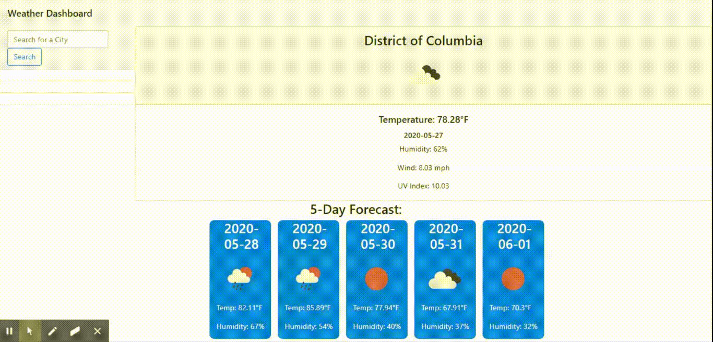

## Table of contents

- [General info](#general-info)
- [Functionality](#functionality)
- [Technologies](#technologies)
- [Github Link](#github-link)

## General Info

This project is a weather application. It uses OpenWeather's API to determine the weather of a specified location. The default is set to Washington DC but can be changed when a user searches for a new city. The cities that are searched are stored in local storage and buttons are dynamically created for each city. Clicking on the city buttons will give you the forecast for that city. Validation is in place so no duplicate buttons are created and something must be inputted.

## Functionality

## Technologies

- Bootstrap version 4
- Font Awesome version 5
- jQuery version 3
- AJAX
- Openweather API
